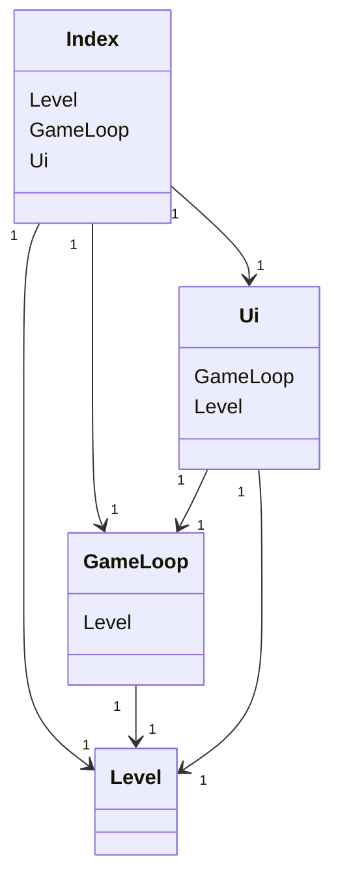
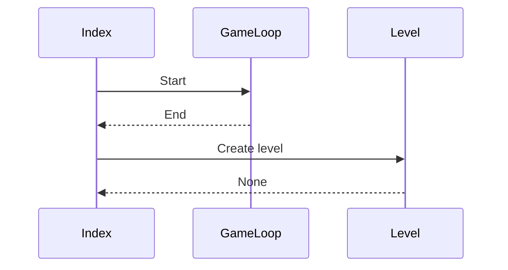

# Arkkitehtuurikuvaus

#### Rakenne

Ohjelma koostuu 

Sovelluslogikka ja käyttöliittymä on pyritty erottamaan mahdollisimman hyvin. GameLoop tiedosto sisältää itse pelin loopin sekä pelin tapahtumien käsittelyn.   Level sisältää sovelluslogiikan ja Ui sisältää käyttöliittymän.

