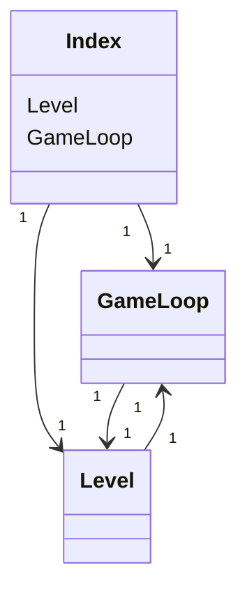
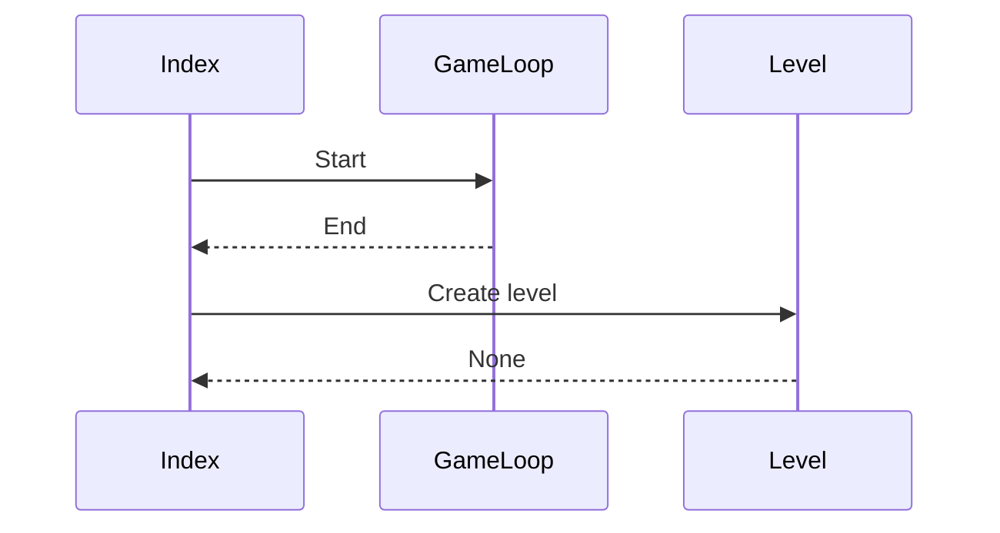

```mermaid
    classDiagram

        Index "1" --> "1" GameLoop
        Index "1" --> "1" Level
        Level "1" --> "1" GameLoop
        GameLoop "1" --> "1" Level

        class Index{
            Level
            GameLoop

        }

    class Level{


    }

    class GameLoop{


    }

```

```mermaid
    sequenceDiagram
        
        participant Index
        participant GameLoop
        participant Level
        Index ->> GameLoop: Start
        GameLoop -->> Index: End
        Index ->> Level: Create level
        Level -->> Index: None
        
```
