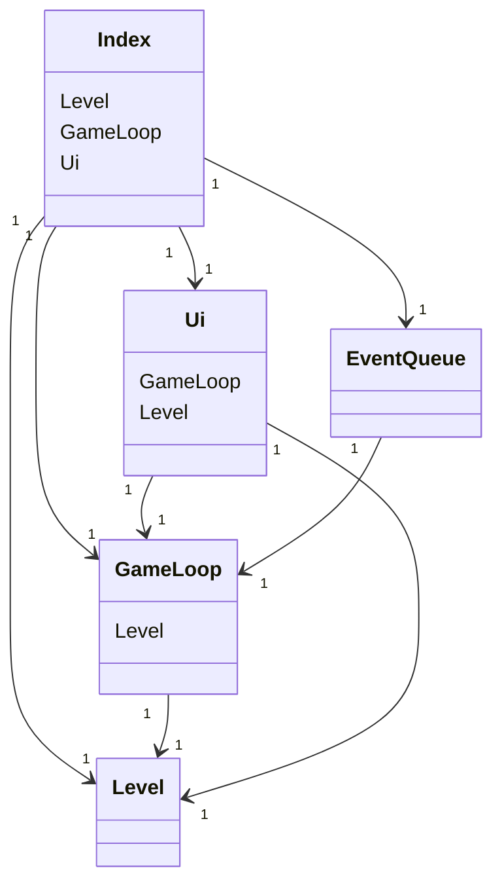
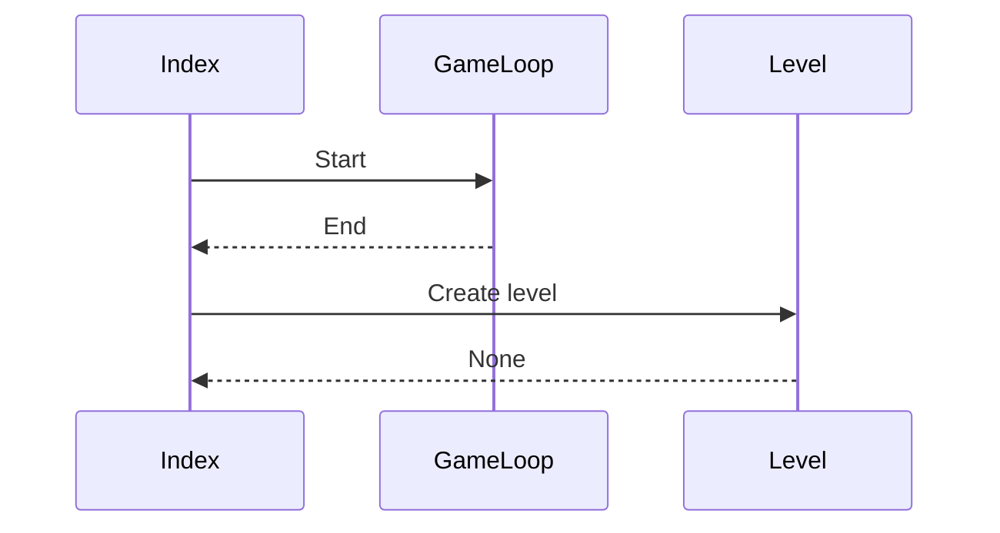

# Arkkitehtuurikuvaus

#### Rakenne

Ohjelma koostuu pääosin neljästä tiedostosta: Index, GameLoop, Ui ja Level.

Sovelluslogikka ja käyttöliittymä on pyritty erottamaan mahdollisimman hyvin. GameLoop tiedosto sisältää itse pelin loopin sekä pelin tapahtumien käsittelyn, kun taas Level sisältää sovelluslogiikan ja Ui käyttöliittymän.

